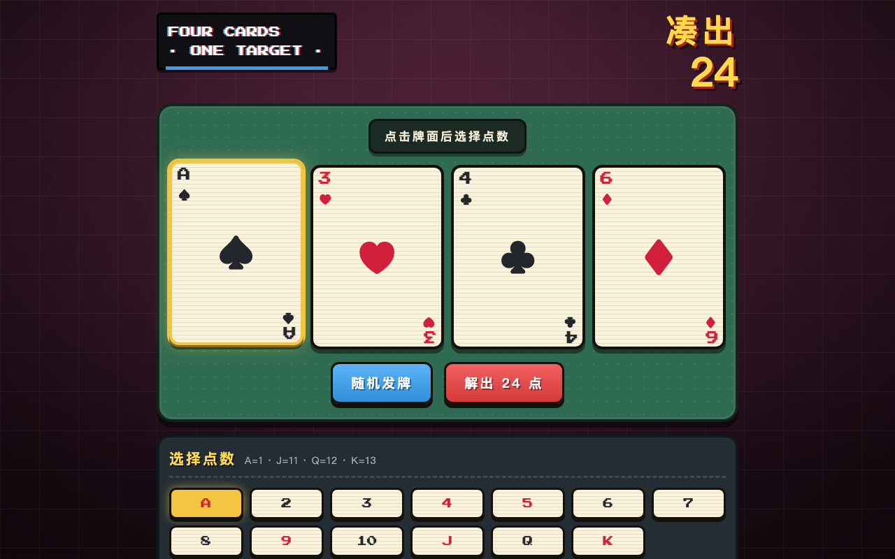

# 24 Solver / 24点纸牌求解器

中文：单文件网页版 24 点纸牌求解器，零依赖，手机与电脑浏览器即开即用。支持点牌换点数、一键随机发牌，穷举全部解法并依交换律与结合律去重。配彩虹流光牌面、翻牌动画与 WebAudio 合成音效。

English: Zero-dependency single-file web app 24-point poker solver. Select custom ranks or deal randomly, compute all unique solutions with algebraic deduplication, featuring rainbow foil card styling, particle effects, and WebAudio synthesized sound.



## 在线体验 / Live Demo

- [Cloudflare Demo](https://24-solver.xiaosang.cc/)
- [GitHub Repo](https://github.com/holynova/24-solver)


## 本地运行 / Run locally

```bash
open index.html
```

## 发布 / Deploy

```bash
npx wrangler deploy --config wrangler.jsonc
```

Cloudflare Workers · Custom Domain: `24-solver.xiaosang.cc`

源码与部署配置使用同一个主分支；在本地手动发布，不创建 Cloudflare 专用分支或 GitHub Action。
